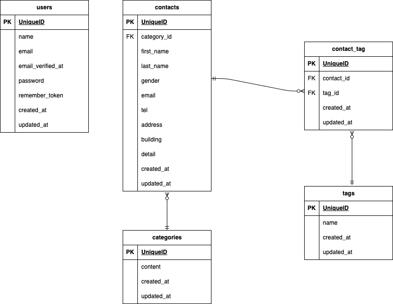

# COACHTECH お問い合わせフォーム

## 概要

本システムは、一般ユーザーが利用する公開のお問い合わせフォームです。

ユーザーはお問い合わせ内容を入力し、確認画面を経由して送信できます。
管理者はログイン後にお問い合わせ内容の閲覧・検索・削除を行うことができます。
また、タグ管理機能、CSVエクスポート機能、お問い合わせ管理APIを実装しています。

## ER図


## 環境構築手順

### リポジトリをクローン
```bash
git clone https://github.com/keiko788/contact-form-app.git
cd contact-form-app
```

### 環境変数ファイル作成
```bash
cp .env.example .env
```

### Dockerコンテナ起動
```bash
./vendor/bin/sail up -d
```

### アプリケーションキー生成
```bash
./vendor/bin/sail artisan key:generate
```

### データベース作成・初期データ投入
```bash
./vendor/bin/sail artisan migrate:fresh --seed
```

### フロントエンド環境構築
```bash
./vendor/bin/sail npm install
./vendor/bin/sail npm run dev
```


## 使用技術
- PHP : 8.2
- Laravel : 10.x
- MySQL : 8.0
- Nginx
- Vite
- Tailwind CSS ^3.4.0
- Docker
- Laravel Sail
- phpMyAdmin

## APIエンドポイント一覧

| メソッド   | URL                   | 説明         |
| ------ | --------------------- | ---------- |
| GET    | /api/v1/contacts      | お問い合わせ一覧取得 |
| GET    | /api/v1/contacts/{id} | お問い合わせ詳細取得 |
| POST   | /api/v1/contacts      | お問い合わせ作成   |
| PUT    | /api/v1/contacts/{id} | お問い合わせ更新   |
| DELETE | /api/v1/contacts/{id} | お問い合わせ削除   |


## 開発環境URL
- アプリケーション
    - http://localhost
- phpMyAdmin
    - http://localhost:8080

## 作成者
長岡啓子